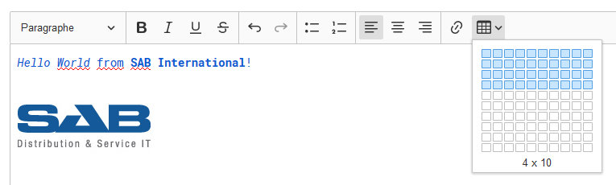

# SAB Rich Text Editor
    

A customized build of [CKEditor](https://ckeditor.com/ckeditor-5), a rich text editor.

## Features
- [Autoformatting](https://ckeditor.com/docs/ckeditor5/latest/features/autoformat.html)
- [Automatic text transformation](https://ckeditor.com/docs/ckeditor5/latest/features/text-transformation.html)
- [Basic text styles](https://ckeditor.com/docs/ckeditor5/latest/features/basic-styles.html): `Bold`, `Italic`, `Strikethrough` and `Underline`.
- [Font](https://ckeditor.com/docs/ckeditor5/latest/features/font.html): `FontColor` and `FontBackgroundColor`.
- [Headings](https://ckeditor.com/docs/ckeditor5/latest/features/headings.html)
- [Horizontal line](https://ckeditor.com/docs/ckeditor5/latest/features/horizontal-line.html)
- [Images](https://ckeditor.com/docs/ckeditor5/latest/features/image.html): `Image`, `ImageCaption`, `ImageResize`, `ImageStyle` and `ImageToolbar`.
- [Link](https://ckeditor.com/docs/ckeditor5/latest/features/link.html)
- [Paste from Office](https://ckeditor.com/docs/ckeditor5/latest/features/pasting/paste-from-word.html)
- [Remove format](https://ckeditor.com/docs/ckeditor5/latest/features/remove-format.html)
- [Tables](https://ckeditor.com/docs/ckeditor5/latest/features/table.html): `Table`, `TableCellProperties`, `TableProperties` and `TableToolbar`.
- [Text alignment](https://ckeditor.com/docs/ckeditor5/latest/features/text-alignment.html)
- [To-do lists](https://ckeditor.com/docs/ckeditor5/latest/features/todo-lists.html)
- and more...
