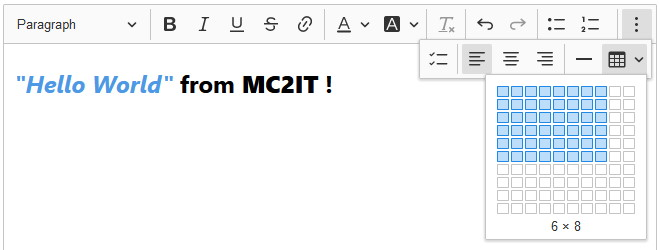

# SAB Rich Text Editor
    



A customized build of [CKEditor](https://ckeditor.com/ckeditor-5), a rich text editor.

## Quick start
Install the latest version of **SAB Rich Text Editor** with [npm](https://www.npmjs.com):

```shell
npm install @sab-international/rich-text-editor
```

For detailed instructions, see the [installation guide](installation.md).
